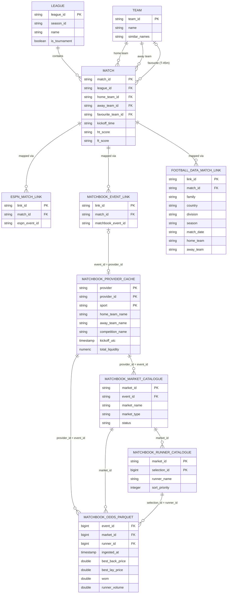

# Core Entity Relationship Diagram (ERD)

This document defines the relational data model for Project Panic Play. To maintain clean boundaries across heterogeneous betting exchanges and data feeds, the system establishes a canonical domain model comprising **Teams**, **Leagues** (including tournaments), and **Matches**, bridged to external APIs via dedicated linking tables.

Furthermore, it details the **Matchbook Data Ingestion Pipeline**, illustrating how raw high-frequency price ticks stored in Apache Parquet files connect to Postgres catalogue and provider cache tables.

---

## Implementation Status: Physical vs. Conceptual

A key architectural distinction in Panic Play is between **conceptual domain abstractions** (canonical target structures) and **concrete physical storage tables** currently implemented in the database schema.

Rather than maintaining separate bespoke tables for every provider entity (e.g., `espn_match_link`, `betfair_match_link`), the physical schema utilizes **high-performance polymorphic caching and linking tables** (`bronze.provider_match_cache` and `bronze.provider_links`).

| Entity / Table Name | Storage Tier | Implementation Status | Physical Storage Mapping / Notes |
| :--- | :--- | :--- | :--- |
| `team` (`silver.team`) | Postgres | **Physical Table Exists** | Distinct canonical table in `silver.team` (accessible via `bronze.team` view). Also cached in `bronze.provider_entity_cache`. |
| `league` (`silver.league`) | Postgres | **Physical Table Exists** | Distinct canonical table in `silver.league` (accessible via `bronze.league` view). Also cached in `bronze.provider_entity_cache`. |
| `match` (`silver.match`) | Postgres | **Physical Table Exists** | Distinct canonical table in `silver.match` (accessible via `bronze.match` view). |
| `espn_match_link` (`silver.espn_match_link`) | Postgres | **Physical Table Exists** | Distinct canonical linking table in `silver.espn_match_link` (accessible via `bronze.espn_match_link` view). |
| `matchbook_event_link` (`silver.matchbook_event_link`) | Postgres | **Physical Table Exists** | Distinct canonical linking table in `silver.matchbook_event_link` (accessible via `bronze.matchbook_event_link` view). |
| `football_data_match_link` (`silver.football_data_match_link`) | DuckDB | **Physical Table Exists** | Linking table mapping canonical matches to football-data.co.uk source rows via a **composite natural key** (the source exposes no stable match id). Materialized in this repo's dbt-owned DuckDB warehouse (`models/silver/canonical/`). |
| `bronze.provider_match_cache` | Postgres | **Physical Table Exists** | Active ingestion table storing fixture snapshots per provider (`provider_id = event_id`). |
| `bronze.matchbook_market_catalogue`| Postgres | **Physical Table Exists** | Active ingestion table storing Matchbook market definitions and trading status. |
| `bronze.matchbook_runner_catalogue`| Postgres | **Physical Table Exists** | Active ingestion table storing runner/selection metadata and sorting priority. |
| `matchbook_odds` | Parquet Lake | **Physical Lake Exists** | Active high-frequency price tick streams written to disk at `/app/data/lake/silver/matchbook_odds/`. |

> **Storage-engine note:** the Postgres references above describe the canonical
> model as ported from the upstream gaming-engine project. In *this* repository the
> canonical schema (`team`, `league`, `match`, `espn_match_link`,
> `matchbook_event_link`, `football_data_match_link`) is materialized in the
> **dbt-owned DuckDB warehouse** as typed dbt models under
> `dbt/data_platform/models/silver/canonical/` (currently empty scaffolds; a later
> conform layer populates them from the football-data.co.uk bronze Parquet).

---

## Entity Relationship Diagram

---

## Core Domain Entities (`silver.*` Tables)

### `team` *(Physical Table Exists: `silver.team` / `bronze.team`)*
Represents a sporting participant or national squad. Implemented as a distinct canonical table in `silver.team` with a transparent view in `bronze.team`.

| Attribute | Type | Nullable | Description |
| :--- | :--- | :--- | :--- |
| `team_id` | `VARCHAR` | No (PK) | Unique internal canonical identifier for the team. |
| `name` | `VARCHAR` | No | Primary display name (e.g., `"United States"`). |
| `similar_names` | `VARCHAR[]` / `JSONB` | Yes | List of alternative names and aliases used across feeds (e.g., `["USA", "United States of America", "USMNT"]`). |

### `league` *(Physical Table Exists: `silver.league` / `bronze.league`)*
Represents a structured sports competition, covering both standard seasonal league formats and cup/knockout tournaments. Implemented as a distinct canonical table in `silver.league` with a view in `bronze.league`.

| Attribute | Type | Nullable | Description |
| :--- | :--- | :--- | :--- |
| `league_id` | `VARCHAR` | No (PK) | Unique internal identifier for the competition. |
| `season_id` | `VARCHAR` | No | Unique identifier per season or edition (e.g., `"2025-2026"` or `"2026"`). |
| `name` | `VARCHAR` | No | Display name of the competition (e.g., `"Premier League"`, `"World Cup"`). |
| `is_tournament` | `BOOLEAN` | No | `true` if the competition is a knockout/group tournament rather than a regular league table. |

### `match` *(Physical Table Exists: `silver.match` / `bronze.match`)*
The central fixture entity linking participants within a league context. Implemented as a distinct canonical table in `silver.match` with a view in `bronze.match`.

| Attribute | Type | Nullable | Description |
| :--- | :--- | :--- | :--- |
| `match_id` | `VARCHAR` | No (PK) | Unique canonical identifier for the fixture. |
| `league_id` | `VARCHAR` | No (FK) | References `league.league_id`. |
| `home_team_id` | `VARCHAR` | No (FK) | References `team.team_id` for the home participant. |
| `away_team_id` | `VARCHAR` | No (FK) | References `team.team_id` for the away participant. |
| `favourite_team_id` | `VARCHAR` | Yes (FK) | References `team.team_id` for the market favourite, captured exactly **T-45 minutes** before scheduled kickoff. |
| `kickoff_time` | `TIMESTAMP` | No | Scheduled kickoff timestamp (e.g. UTC ISO 8601 or epoch ms), used as the baseline for pre-match timings. |
| `ht_score` | `VARCHAR` | Yes | Half-time scoreline (e.g., `"1-0"`). |
| `ft_score` | `VARCHAR` | Yes | Full-time scoreline (e.g., `"2-1"`). |

---

## Provider Linking Tables (`silver.*` Tables)

To isolate external feed idiosyncrasies from core trading logic, provider entities are linked to canonical matches via external mapping tables. These are now established as distinct canonical tables in `silver` alongside polymorphic cache mappings.

### `espn_match_link` *(Physical Table Exists: `silver.espn_match_link` / `bronze.espn_match_link`)*
Maps internal canonical matches to ESPN live state and score feeds.

| Attribute | Type | Nullable | Description |
| :--- | :--- | :--- | :--- |
| `link_id` | `VARCHAR` | No (PK) | Primary key for the mapping record. |
| `match_id` | `VARCHAR` | No (FK) | References canonical `match.match_id`. |
| `espn_event_id` | `VARCHAR` | No | External event ID provided by the ESPN API. |

### `matchbook_event_link` *(Physical Table Exists: `silver.matchbook_event_link` / `bronze.matchbook_event_link`)*
Maps internal canonical matches to Matchbook exchange events for trading and odds ingestion.

| Attribute | Type | Nullable | Description |
| :--- | :--- | :--- | :--- |
| `link_id` | `VARCHAR` | No (PK) | Primary key for the mapping record. |
| `match_id` | `VARCHAR` | No (FK) | References canonical `match.match_id`. |
| `matchbook_event_id` | `VARCHAR` | No | External event ID provided by the Matchbook API (`event_id`). |

### `football_data_match_link` *(Physical DuckDB Table Exists: `silver.football_data_match_link`)*
Maps internal canonical matches to source rows from **football-data.co.uk** (the
historical results/odds CSV feed ingested by this repo's bronze layer).

Unlike ESPN and Matchbook, football-data.co.uk exposes **no stable per-match
identifier**, so the external reference is a **composite natural key** rather than a
single id column. The key columns mirror the two raw bronze record cores in
`src/data_platform/models/schemas.py` — `MainMatchRecord` (`Div`, `Date`,
`HomeTeam`, `AwayTeam`) and `ExtraMatchRecord` (`Country`, `League`, `Season`,
`Date`, `Home`, `Away`) — unified into one shape. Uniqueness of
`(family, country, division, season, match_date, home_team, away_team)` is asserted
by a dbt test.

| Attribute | Type | Nullable | Description |
| :--- | :--- | :--- | :--- |
| `link_id` | `VARCHAR` | No (PK) | Primary key for the mapping record. |
| `match_id` | `VARCHAR` | No (FK) | References canonical `match.match_id`. |
| `family` | `VARCHAR` | No | Football-data.co.uk dataset family: `'main'` or `'extra'`. |
| `country` | `VARCHAR` | Yes | Country (extra family only; `null` for main, where the league directory implies it). |
| `division` | `VARCHAR` | No | `Div` for main (e.g. `'E0'`) / `League` for extra. |
| `season` | `VARCHAR` | No | Season token (e.g. `'2324'` from the URL path, or in-file `Season` for extra). |
| `match_date` | `VARCHAR` | No | Raw source match date as supplied by the CSV. |
| `home_team` | `VARCHAR` | No | Raw source home team name (`HomeTeam` / `Home`). |
| `away_team` | `VARCHAR` | No | Raw source away team name (`AwayTeam` / `Away`). |

---

## Matchbook Data Ingestion & Odds Lake (Physical Tables)

The Matchbook ingestion pipeline splits physical data storage into two active tiers: **Postgres Catalogue Tables** (storing structured fixture and orderbook metadata) and an **Apache Parquet Data Lake** (storing high-frequency price tick streams).

### Linkage Architecture
The join bridge connecting raw Parquet odds files to structured relational metadata operates across three keys:
1. **Event Level**: `matchbook_odds_parquet.event_id` joins directly against `bronze.provider_match_cache.provider_id` (where `provider = 'matchbook'`) and `matchbook_market_catalogue.event_id`. This attaches high-level match context (teams, kickoff time, competition).
2. **Market Level**: `matchbook_odds_parquet.market_id` joins against `bronze.matchbook_market_catalogue.market_id`. This identifies market definitions (e.g., `"Match Odds"`, `"Asian Handicap"`).
3. **Runner Level**: `matchbook_odds_parquet.runner_id` joins against `bronze.matchbook_runner_catalogue.selection_id`. This identifies specific betting selections (e.g., `"Home Team"`, `"Draw"`).

---

### `bronze.provider_match_cache` *(Physical Postgres Table Exists)*
Stores discovered upcoming and live fixtures across providers. When `provider = 'matchbook'`, the `provider_id` column represents Matchbook's canonical `event_id`.

| Attribute | Type | Nullable | Description |
| :--- | :--- | :--- | :--- |
| `provider` | `VARCHAR(50)` | No (PK) | Data source identifier (e.g., `'matchbook'`, `'espn'`). |
| `provider_id` | `VARCHAR(255)` | No (PK) | External unique identifier. For Matchbook, this is the `event_id`. |
| `sport` | `VARCHAR(20)` | No (PK) | Sport identifier (e.g., `'rugby_union'`, `'football'`). |
| `home_team_id` | `VARCHAR(255)` | No | Provider's internal ID for the home team. |
| `home_team_name` | `VARCHAR(500)` | No | Provider's display name for the home team. |
| `away_team_id` | `VARCHAR(255)` | No | Provider's internal ID for the away team. |
| `away_team_name` | `VARCHAR(500)` | No | Provider's display name for the away team. |
| `competition_id` | `VARCHAR(255)` | No | Provider's internal ID for the league/tournament. |
| `competition_name` | `VARCHAR(500)` | No | Provider's display name for the league/tournament. |
| `kickoff_utc` | `TIMESTAMPTZ` | Yes | Scheduled kickoff timestamp in UTC. |
| `status` | `VARCHAR(50)` | No | Fixture status (e.g., `'STATUS_SCHEDULED'`, `'STATUS_IN_PROGRESS'`). |
| `refreshed_at` | `TIMESTAMPTZ` | No | Timestamp of last successful polling refresh. |
| `betfair_id` | `VARCHAR(255)` | Yes | Cross-reference identifier mapping to Betfair exchange. |
| `total_liquidity` | `NUMERIC(15,2)` | No | Total matched traded volume across all markets for this event. |

---

### `bronze.matchbook_market_catalogue` *(Physical Postgres Table Exists)*
Captures metadata for available betting markets discovered under each Matchbook event.

| Attribute | Type | Nullable | Description |
| :--- | :--- | :--- | :--- |
| `market_id` | `TEXT` | No (PK) | Unique identifier for the betting market. |
| `event_id` | `TEXT` | No (FK) | Parent Matchbook event ID (joins with `provider_match_cache.provider_id`). |
| `market_name` | `TEXT` | No | Human-readable name of the market (e.g., `'Match Odds'`, `'Handicap'`). |
| `market_type` | `TEXT` | No | Normalized market classification (e.g., `'match_result'`, `'total'`). |
| `status` | `TEXT` | No | Trading state of the market (`'open'`, `'closed'`, `'suspended'`). |
| `ingested_at` | `TIMESTAMPTZ` | No | Timestamp when this market metadata was captured. |

---

### `bronze.matchbook_runner_catalogue` *(Physical Postgres Table Exists)*
Captures metadata for individual runners (selections) within a Matchbook market.

| Attribute | Type | Nullable | Description |
| :--- | :--- | :--- | :--- |
| `market_id` | `TEXT` | No (PK/FK) | References `matchbook_market_catalogue.market_id`. |
| `selection_id` | `BIGINT` | No (PK) | Unique runner identifier within the market (corresponds to `runner_id` in Parquet lake). |
| `runner_name` | `TEXT` | No | Display name of the selection (e.g., `'Crusaders'`, `'Draw'`). |
| `sort_priority` | `INTEGER` | No | Display ordering priority assigned by the exchange. |
| `ingested_at` | `TIMESTAMPTZ` | No | Timestamp when selection metadata was recorded. |
| `market_name` | `TEXT` | Yes | Denormalized market name for query optimization. |
| `market_type` | `TEXT` | Yes | Denormalized market type for query optimization. |

---

### `matchbook_odds` *(Physical Apache Parquet Data Lake Exists)*
Stores high-frequency price and liquidity snapshot ticks. Written by `parquet-ingestor` (`direct_parquet_consumer.py`) to disk at `/app/data/lake/silver/matchbook_odds/year={YYYY}/month={MM}/day={DD}/part-{ts}.parquet`.

| Attribute | Type | Nullable | Description |
| :--- | :--- | :--- | :--- |
| `event_id` | `BIGINT` | No (FK) | Matchbook event ID. Joins with `provider_match_cache.provider_id`. |
| `market_id` | `BIGINT` | No (FK) | Matchbook market ID. Joins with `matchbook_market_catalogue.market_id`. |
| `runner_id` | `BIGINT` | No (FK) | Selection ID. Joins with `matchbook_runner_catalogue.selection_id`. |
| `ingested_at` | `TIMESTAMP` | No | Exact timestamp when the price tick was captured off the wire. |
| `sport_id` | `BIGINT` | Yes | Numeric exchange ID representing the sport. |
| `market_type` | `TEXT` | Yes | String representation of the market classification. |
| `market_status` | `TEXT` | Yes | String representation of trading status (`'open'`, `'suspended'`). |
| `in_running` | `BOOLEAN` | Yes | `true` if the event is live / in-play at the moment of capture. |
| `best_back_price` | `DOUBLE` | Yes | Best available back price (decimal odds). |
| `best_back_available` | `DOUBLE` | Yes | Volume available to bet at the best back price. |
| `best_lay_price` | `DOUBLE` | Yes | Best available lay price (decimal odds). |
| `best_lay_available` | `DOUBLE` | Yes | Volume available to lay at the best lay price. |
| `back_price_2/3` | `DOUBLE` | Yes | Odds at the 2nd and 3rd orderbook depth tiers. |
| `back_available_2/3` | `DOUBLE` | Yes | Available volume at the 2nd and 3rd back depth tiers. |
| `lay_price_2/3` | `DOUBLE` | Yes | Odds at the 2nd and 3rd lay depth tiers. |
| `lay_available_2/3` | `DOUBLE` | Yes | Available volume at the 2nd and 3rd lay depth tiers. |
| `back_depth` | `STRUCT` / `JSON`| Yes | Nested array containing full orderbook back depth levels. |
| `lay_depth` | `STRUCT` / `JSON`| Yes | Nested array containing full orderbook lay depth levels. |
| `wom` | `DOUBLE` | Yes | Weight of Money indicator calculated across available market depths. |
| `market_volume` | `DOUBLE` | Yes | Cumulative matched volume traded across the entire market. |
| `runner_volume` | `DOUBLE` | Yes | Cumulative matched volume traded specifically on this runner. |
| `handicap_line` | `DOUBLE` | Yes | Handicap line value (e.g., `+1.5`, `-0.5`) where applicable. |
| `event_participant_id` | `BIGINT` | Yes | Internal Matchbook ID mapping runner to an event participant. |
