# Component diagram — Data Platform (medallion ingestion)

> C4 Level 3 component view of the current Dagster code location (`src/data_platform`):
> the bronze ingest edge, Pydantic/Pandera validation, the dbt assets +
> `BronzeAwareTranslator`, and the gold publish asset, plus their relationships to
> DuckDB, the Parquet lake, the source API and OpenTelemetry.

```mermaid
C4Component
    title Component diagram — Data Platform (medallion ingestion)

    Person(operator, "Data Operator", "Triggers runs and inspects assets in the Dagster UI")
    System_Ext(source_api, "Source API", "HTTP JSON endpoint at API_BASE_URL exposing /users")
    System_Ext(signoz, "SigNoz", "Observability backend receiving OTel traces")

    ContainerDb(warehouse, "DuckDB Warehouse", "DuckDB file", "Single-writer analytical store; dbt owns the file")
    ContainerDb(parquet, "Parquet Lake", "Parquet files on disk (DATA_DIR)", "Bronze / silver / gold layers persisted as Parquet")
    Container(otel_collector, "OTel Collector", "OpenTelemetry Collector", "Receives OTLP spans and forwards to SigNoz")
    Container(dbt_project, "dbt Project (data_platform)", "dbt-duckdb", "Builds + tests silver/gold models on DuckDB")

    Container_Boundary(platform, "Data Platform (Dagster code location)") {
        Component(definitions, "Dagster Definitions", "Python / Dagster", "Assembles assets, the medallion_hello_world job, daily schedule and the dbt resource (definitions.py)")
        Component(config, "Settings", "Python / pydantic-settings", "Env-driven config: DATA_DIR, DUCKDB_PATH, API_BASE_URL, OTEL endpoint (config.py)")
        Component(otel, "Telemetry", "Python / OpenTelemetry", "Installs the tracer provider once; auto-instruments requests (otel.py)")

        Component(raw_users, "raw_users (bronze asset)", "Python / Dagster asset", "The only network edge: GETs the API, validates, lands bronze Parquet (assets/bronze.py)")
        Component(pydantic, "User schema", "Python / Pydantic v2", "Per-record edge validation + flattening (models/schemas.py)")
        Component(pandera, "bronze_users_schema", "Python / Pandera", "Frame-level dtype/nullability/range validation (models/validation.py)")

        Component(dbt_assets, "dbt_models + BronzeAwareTranslator", "Python / dagster-dbt", "Runs dbt build; maps dbt source users to AssetKey([raw_users]) to draw lineage (assets/dbt.py)")
        Component(publish_gold, "publish_gold_parquet (gold asset)", "Python / Dagster asset", "Reads the gold Parquet published by dbt, attaches metadata, emits gold-layer span (assets/gold.py)")
    }

    Rel(operator, definitions, "Triggers jobs / browses assets", "Dagster UI")
    Rel(definitions, raw_users, "Registers as asset")
    Rel(definitions, dbt_assets, "Registers as asset + dbt resource")
    Rel(definitions, publish_gold, "Registers as asset")
    Rel(definitions, otel, "configure_telemetry() on import")

    Rel(raw_users, source_api, "GET /users", "HTTPS")
    Rel(raw_users, pydantic, "Validates each record")
    Rel(raw_users, pandera, "Validates the frame")
    Rel(raw_users, parquet, "Writes bronze/users.parquet")
    Rel(raw_users, config, "Reads api_base_url, bronze_dir")
    Rel(raw_users, otel, "Emits ingest span")

    Rel(dbt_assets, dbt_project, "Invokes dbt build")
    Rel(dbt_project, parquet, "Reads bronze Parquet (external source); writes gold export Parquet")
    Rel(dbt_project, warehouse, "Builds silver view + gold table; runs tests")
    Rel(dbt_assets, raw_users, "Depends on (bronze to silver)", "via translator")

    Rel(publish_gold, dbt_assets, "Depends on gold.users_by_city_export")
    Rel(publish_gold, parquet, "Reads gold/users_by_city.parquet", "DuckDB read_parquet")
    Rel(publish_gold, otel, "Emits gold publish span")

    Rel(otel, otel_collector, "Exports OTLP spans", "gRPC/HTTP")
    Rel(otel_collector, signoz, "Forwards traces")
```

