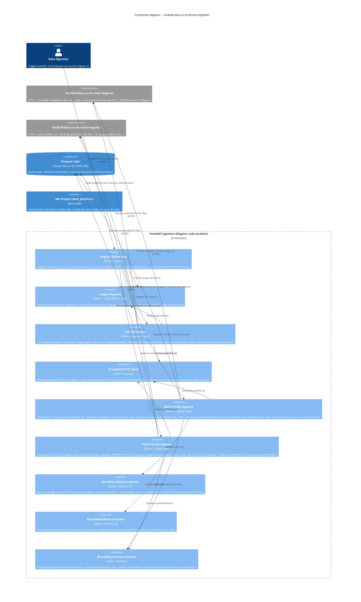

# Component diagram — football-data.co.uk Bronze Ingestion

> C4 Level 3 component view of the proposed football-data.co.uk bronze ingestion pipeline.
> Findings: `investigations/football-data-co-uk-ingestion/findings.md`
> Decisions: `investigations/football-data-co-uk-ingestion/decisions.md`

